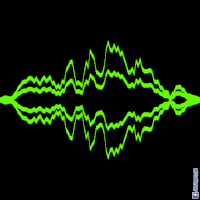
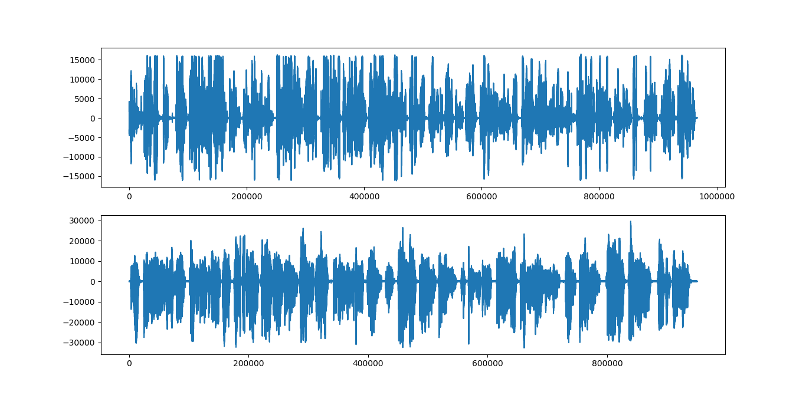
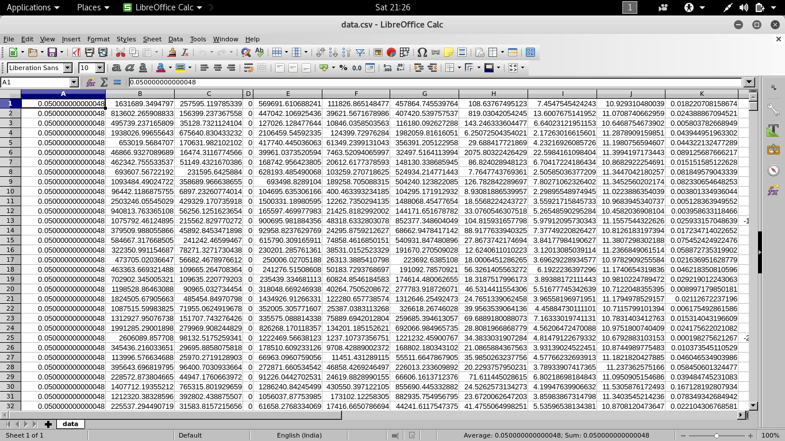
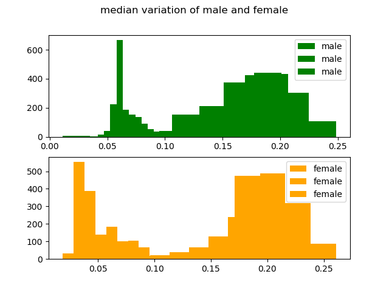
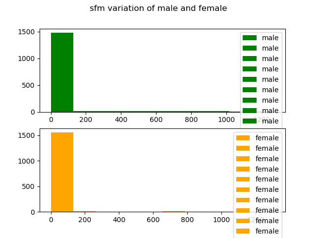
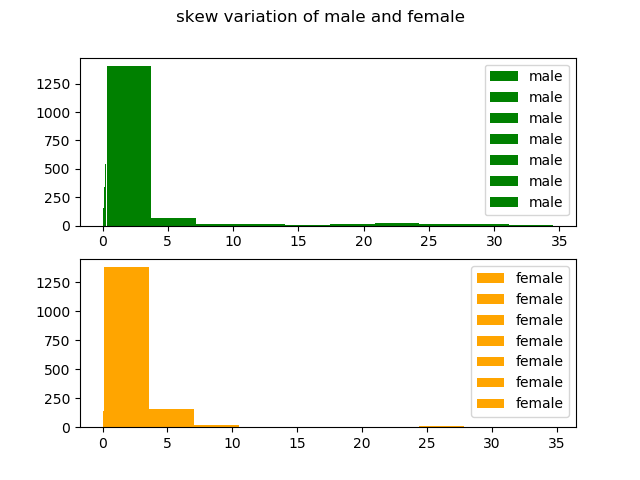
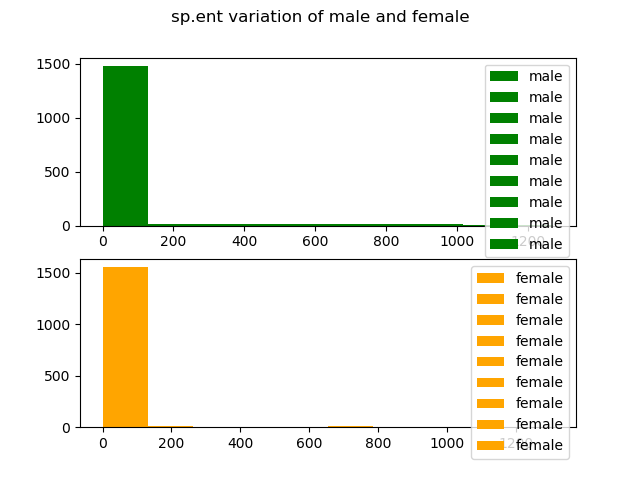

# Grender-classification-Artificial-Neural-Nets

This classifiers the gender of the person speaking in the singular audio file using Artificial Neural Networks

<b> Audio </b>       
         

<b> Male/Female </b>

# Project Structure

    1.Introduction and Papers.
    2.Approches
    3.Data collection and Preprocessing
    4.signal Transformation
    5.Feature Extraction and visualisation
    6.Training
    7.Testing
    8.Evaluation
    9.Output
    10.References
    
# 1. Introduction

This project uses a mathamatical approach to determine the gender of the person speaking in the audio file .the implementation focusses more on the audio that consist the voice of a single person speaking at a time.As we know that directly we cannot use the audio data because it may consist some noise and other factors that we may not want to use.

To make our work easier we will be using the algorithm called <b> Fast Fourier Transformation (FFT) </b> . this technique will help us to extract better <b>quality of features</b> and those features will be using to train the classification model using Deep Neural Networks method called <b> Artificial Neural Networks</b>

## Papers 

The papers which we will be going to focus more are :

	1.Gender Classification in Speech Recognition using Fuzzy Logic and Neural Network # 3rd paper in the papers dataset
	2.Musical Genre Classification of Audio Signals # 4th paper from the IEEE Papers dataset

# 2.Approches

The steps that we are going to take to build the model are as follows:

	1. Load the audio file.
	2. Transform the audio signal using FFT.
	3. Extract meaningful features.
	4. create the dataset.
	5. cleaning the dataset.
	6. scaling the dataset.
	7. Building Neural Nets.
	8. Training the model.
	9. Accuracy calculation.
	10.Performance tuning.
	11.Deploying the Model.

# 3.Data collection and Preprocessing

I have uploaded the dataset that i used in the dataset forlder which contains two types of data.The first type of data is the actual audio data nad the second type of data is the the csv data whch contains the extracted features from real audio data.
I will be shuffleing both the data after extraction of features.

# 4.Signal Transformation

Initially the data dataset contains all the audio files, so we need to transform each audio file in the folder using <B> FFT </B>.

FFT IMPLEMENTATION IN PYTHON3

		#defining omega for FFT
		@classmethod
		def omega(self,p, q):
			return cmath.exp((2.0 * cmath.pi * 1j * q) / p)
	
		#actual defination for Fast fourier Transformation (FFT)
		@classmethod
		def fft(self,signal):
	
			#length of the signal
			n = len(signal)
			if n == 1:
				return signal
			else:
				#splitting into even and odd set
				Feven = self.fft([signal[i] for i in range(0, n, 2)])
				Fodd = self.fft([signal[i] for i in range(1, n, 2)])

 			
			combined = [0] * n #combining the both list
			for m in range(n//2):
				combined[m] = Feven[m] + self.omega(n, -m) * Fodd[m]
				combined[m + n//2] = Feven[m] - self.omega(n, -m) * Fodd[m]
 			
			#returning while converting list to numpy array
			return np.array(combined)

<b> sample audio plotting :</b>

<b> Male vs Female </b>

<b> Male vs Female </b>

<b> sample audio plotting after transformation: </b>

# 5.Feature Extraction and visualisation

The List of MFCC Features which i will be using are as follows :

	1.Mean Frequency
	2.Standard Devation
	3.Median
	4.Third Quartile (Q75)
	5.First Quartile(Q25)
	6.Inter Quartile(IQR)
	7.Skewness
	8.Kurtosis
	9.Spectral Entropy
	10.Spectral Flatness
	11.Mode
	12.Central Frequency

	Q.What is MFCC ?

	Ans:-Mel-frequency cepstral coefficients (MFCCs) are coefficients that collectively make up an MFC.
	They are derived from a type of cepstral representation of the audio clip (a nonlinear "spectrum-of-
	a-spectrum").

References Used :

<b>“The International Arab Journal of Information Technology, Vol. 10, No. 5, September 2013”</b>

## Dataset Snapshot

## Extracted Feature

## Visualization

